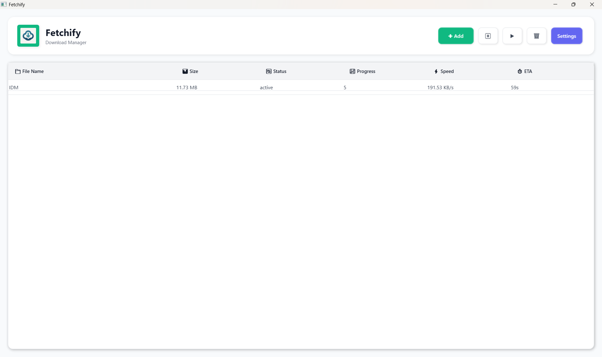

# 🚀 Fetchify

[](https://github.com/Talha24079/Fetchify/releases/latest)

**Fetchify** is a lightweight download manager powered by `aria2` and built with a clean WPF interface. It helps you manage downloads with pause/resume support, auto-reconnect, and segmented downloading — all packed in a simple installer.

---

## ✨ Features

- ✅ Pause and resume downloads
- ✅ Auto-reconnect on failures
- ✅ Parallel segmented downloading
- ✅ Persistent download state (remembers paused and completed tasks)
- ✅ Clean and responsive WPF user interface


## 🖼 Screenshots


---

## 🔧 Built With

- `.NET` and `C#`
- `WPF` for desktop GUI
- `aria2` (download engine)
- Visual Studio Installer Project

---

## 🧑‍💻 For Developers

Clone the repo and open `FetchifySolution.sln` in Visual Studio. Make sure `aria2c` is included or configured correctly in your build.

```bash
git clone https://github.com/Talha24079/Fetchify.git
